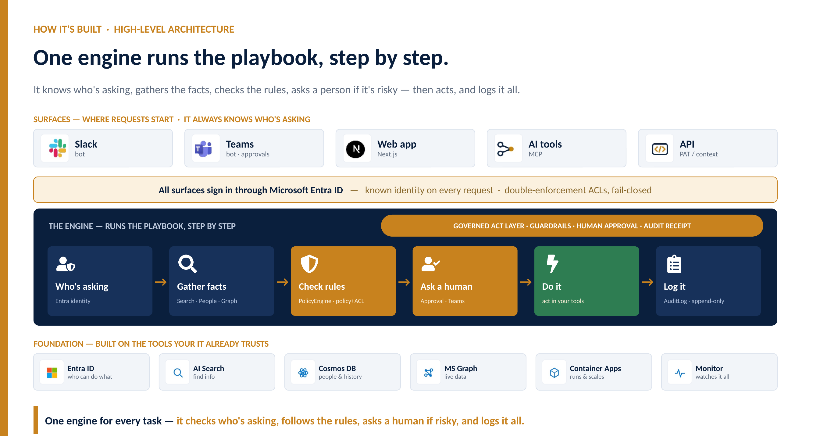

# SubstrateOS — the Company Brain

> The operating system for AI-native enterprises.

**Building AI agents is easy now. Trusting them with real work is the hard part.** How a company actually runs — how a refund gets handled, a discount approved, an outage triaged — was never written down. It lives in people's heads and across a dozen tools, so AI can't see it, follow it, or be trusted to act on it.

SubstrateOS is the company's brain: it captures that know-how and makes it runnable by AI under your controls — **retrieve the facts → reason → act → log it** — grounded in your real data, identity-aware, and auditable end to end. The intelligence isn't a bigger model; it's *capturing how the work is actually done* and making it safe to run.

**What runs today, on real Azure:** grounded, cited answers over enterprise content, access-controlled per user via Entra ID + ACLs, and ranked by four live signals — Content, People, Activity, and Recency (Microsoft Graph live-fetch). This is the retrieve-and-reason foundation an AI-native org runs on.

**The scenario it's built for:** a customer-support refund that's over the auto-approve limit is caught, routed to a manager for sign-off, issued, and written to the audit log — automated, but never out of control. Everything sits on Microsoft (Entra ID, Azure AI Search, Cosmos DB, Microsoft Graph, Container Apps, Monitor).



*Setup and run instructions are below. Architecture spec: [`docs/superpowers/specs/`](docs/superpowers/specs/) · implementation plans: [`docs/superpowers/plans/`](docs/superpowers/plans/).*

---

Production-grade intelligence layer for unified enterprise search and LLM
orchestration on Microsoft Azure. See `docs/superpowers/specs/` for the
architecture spec and `docs/superpowers/plans/` for implementation plans.

## Phase 1 demo (Days 0–2)

Grounded Q&A with citations against ~12 markdown docs, end-to-end on real
Azure services.

### Prerequisites

1. Azure subscription with Owner/Contributor.
2. Azure OpenAI quota approved in the chosen region (default `swedencentral` (eastus2 was capacity-blocked at provision time)).
3. Entra ID tenant admin (for app registrations + admin consent).
4. `az` CLI logged in (`az login`), `uv` and `pnpm` installed locally.

### Bootstrap

```
./infra/provision.sh                # ~15 min, prints .env block at end
# follow infra/entra_setup.md       # ~15 min — Entra app reg in portal (manual)
cp <pasted .env block> substrateos-api/.env
```

### Run

```
# Terminal 1
cd substrateos-api && uv sync
uv run python scripts/create_search_index.py   # one-time index creation
uv run uvicorn app.main:app --port 8000

# Terminal 2 — load test corpus
cd substrateos-api && uv run python eval/load_corpus.py

# Terminal 3 — web
cd web && pnpm install && pnpm dev
```

Open <http://localhost:3000>, sign in with Entra, ask:

- "what is our PTO policy?"
- "how should I respond to a payments service alert?"
- "what is our Q3 ARR target?"

Each should return a grounded answer with one or more citations linking to
the corpus markdown file.

### Verify quality

```
cd substrateos-api
uv run python eval/run_eval.py --mode retrieval
```

Expected: `recall_at_10 >= 0.7`, `mrr_at_10 >= 0.5`.
Phase 1 baseline: 1.0 / 1.0 on 10 golden Qs (2026-05-29).

## Layout

- `substrateos-api/` — FastAPI monolith (Zone 4 intelligence layer)
- `web/` — Next.js 14 chat UI with Entra SSO
- `infra/` — Azure provisioning (`az` CLI; Bicep later)
- `docs/` — specs and plans

## Next phases

- Phase 2a (done): People pillar (Cosmos Gremlin), query-time ACL re-check,
personalized ranker (Content + People). Same query → different ranking per user.
- Phase 2b (done): Activity pillar (Azure Data Explorer free cluster) + engagement
signal as the ranker's third weighted term. /feedback ingests events; recent
engagement lifts ranking.
- Phase 3 (done): Live Fetch via Microsoft Graph /search — freshness queries merge
live results into ranking. Heuristic trigger; DefaultAzureCredential (single-identity).
- Phase 4 (done, pure-code Zone 4 completion): LLM plan-step classifier, ranker
recency signal, per-event-type engagement weighting, ACL freshness gate, eval
isolation.
- Phase 5 (infra / needs Entra): per-user OBO for Live Fetch, APIM gateway,
OpenTelemetry, Event Hubs ingest path, per-tenant index isolation, JWKS caching.

Each gets its own plan in `docs/superpowers/plans/`.

## Run the web chat (SubstrateOS, light)

```
# terminal 1 — API
cd substrateos-api && uv run uvicorn app.main:app --port 8000
# terminal 2 — web
cd web && cp .env.local.example .env.local && pnpm install && pnpm dev
```

Open <http://localhost:3000>. Runs via debug-auth (no SSO); queries the `t-eval` tenant
where the demo corpus lives. Ask "what is our PTO policy?" → grounded answer with a
citation, and the right rail shows the real Content/People/Activity/Recency ranking
signals for that answer. Helpful / Not quite buttons feed the Activity pillar.
